# In progress

  
  

  
## My metrics

 
  

More About my account

  
## My achivements:

  

  

More About me

  
  ### My music list
  
  
  
  ## My anime list:
  
  
  
  ### My social medias:
  
  #### Discord
  <!-- dark mode -->
  
  <!-- light mode -->
  
  

  

  
  

